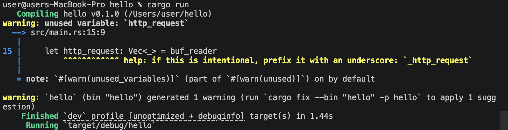
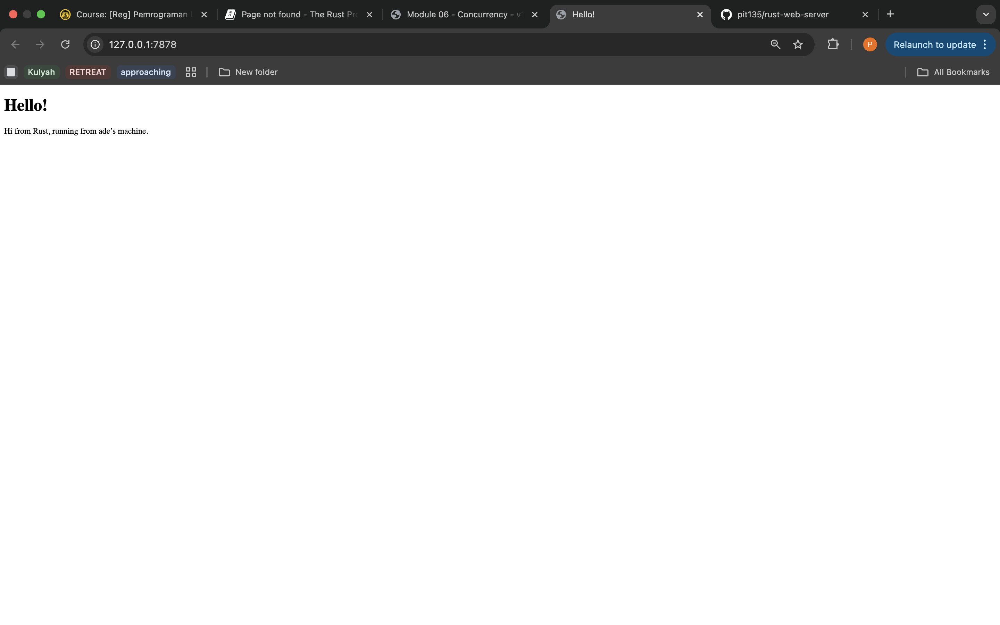

[Commit 1 Reflection notes]

Pada tahap ini, saya buat server sederhana menggunakan Rust yang bisa terima koneksi dari browser dan membaca HTTP request yang dikirimkan. Saat server dijalankan pake cmd 'cargo run' dan browser mengakses `http://127.0.0.1:7878`, server terima beberapa request dan ditampilin di terminal

1. Cara Kerja Program
a. TcpListener
TcpListener::bind("127.0.0.1:7878")` dipake untuk:
- buka port 7878
- listen koneksi dari client (browser)

b. Incoming Connection
for stream in listener.incoming()

Loop ini akan:
- gunakan koneksi masuk
- setiap koneksi direpresentasikan sebagai TcpStream

c. Handle Connection
setiap koneksi dikirim ke fungsi:
handle_connection(stream);

2. Membaca HTTP Request
a. BufReader
let buf_reader = BufReader::new(&mut stream);
dipake untuk baca data dari stream
b. Baca per baris
.lines()
HTTP request dibaca baris per baris
c. Berhentiin pembacaan
.take_while(|line| !line.is_empty())
berfungsi untuk:
berhenti pas nemuin baris kosong, karna dalam HTTP, baris kosong menandakan akhir header

3. Struktur HTTP Request

Dari hasil output, request yang diterima formatnya seperti:

GET / HTTP/1.1
Host: 127.0.0.1:7878
User-Agent: Mozilla/5.0 ...
Accept: text/html ...

=> Penjelasan:
GET / HTTP/1.1 → request line
Host → alamat server
User-Agent → informasi browser
Accept → tipe konten yang bisa diterima browser

4. Observasi Hasil
Saat saya buka browser, muncul banyak output seperti:
Request: [ ... ]
Request: [ ... ]
Request: [ ... ]
....

Ini terjadi karena:
- browser kirim beberapa request secara otomatis
- retry kalau ga dapet response
- bisa juga karena fitur seperti keep alive

5. Warning pada Program
warning: unused variable: `stream`
Terjadi karena pada versi awal, variable stream ga dipake
Tapi setelah menggunakan handle_connection, warning ini ga lagi menjadi masalah

6. Kesimpulan
- browser komunikasi dengan server menggunakan HTTP request
- server baca request dalam bentuk teks
- rust bisa digunakan untuk membuat server sederhana menggunakan TcpListener dan TcpStream
- HTTP request terdiri dari beberapa baris yang diakhiri dengan baris kosong
- satu kali akses browser ga selalu hasilin satu request aja  
  

[Commit 2 Reflection notes]

Pada milestone ini, saya belajar bagaimana web server sederhana di Rust bisa  mengembalikan (return) halaman HTML ke browser
Fungsi handle_connection untuk tangani setiap koneksi yang masuk dari client (browser). Pertama, program baca HTTP request pake BufReader dan ambil baris-baris request sampai temukan baris kosong yang menandakan akhir header, selanjutnya, server buat response HTTP secara manual
Response ini terdiri dari:
- status line: HTTP/1.1 200 OK
- header: Content-Length, yang menunjukkan panjang konten HTML
- body: isi dari file hello.html  
File HTML dibaca pake fs::read_to_string, lalu panjangnya diitung untuk dimasukkan ke header. Terakhir, response yang udah diformat dikirim lagi ke browser pake stream.write_all(). Browser lalu merender isi HTML tersebut sehingga bisa ditampilkan sebagai halaman web 

Dari percobaan ini, saya memahami bahwa komunikasi antara browser dan server pake protokol HTTP, dan server harus mengirim response pake format yang benar supaya browser bisa nampilin dengan baik

  

[Commit 3 Reflection notes]

Pada milestone ini, saya mempelajari bagaimana server bisa validasi request dari client dan kasih response yang beda berdasarkan URL yang diminta. Server baca request line pertama dari HTTP request, kaya "GET / HTTP/1.1", trus pake struktur match untuk nentuin response yang sesuai, kalo client minta root ("/"), server mengembalikan file hello.html dengan status 200 OK, tapi kalo request ga dikenalin, server mengembalikan status 404 NOT FOUND beserta halaman error

Proses ini ninjukin konsep routing sederhana pada web server, di mana server memetakan request tertentu ke response tertentu, refactoring dilakukan dengan memisahkan logika penentuan response (status dan file) dari proses pengiriman response, jadinya kode lebih rapi dan mudah dikembangkan. Saya juga memahami bahwa pemisahan ini penting supaya server bisa dengan mudah ditambahkan fitur baru seperti routing yang lebih kompleks di masa depan  

[Commit 4 Reflection notes]

Pada milestone ini, saya simulasikan kondisi server yang lambat dengan tambahkan endpoint /sleep yang akibatkan thread berhenti selama 10 detik sebelum berikan response. Dari percobaan ini, bisa diliat kalo saat satu request lagi diproses (misalnya /sleep), request lain harus nunggu hingga proses tersebut selesai, ini terjadi karena server berjalan secara single-threaded, jadinya cuma bisa tangani satu koneksi pada satu waktu
Masalah ini nunjukin keterbatasan server sederhana, terutama kalau digunakan oleh banyak user secara bersamaan, jadinya, diperlukan pendekatan multithreading supaya server bisa menangani banyak request secara paralel tanpa saling nunggu  

[Commit 5 Reflection notes]

Pada milestone ini, saya mengimplementasikan multithreading pake ThreadPool untuk meningkatkan performa server, yang sebelumnya, server cuma bisa ttangani satu request dalam satu waktu, tapi dengan ThreadPool, setiap request yang masuk akan diproses dalam thread yang beda, sehingga server bisa menangani banyak request secara bersamaan
ThreadPool bekerja dengan menyediakan sejumlah thread yang siap digunakan untuk jalankan task, dimana saat ada request baru, task tersebut akan diberikan ke salah satu thread tanpa harus buat thread baru setiap kali, dengan pendekatan ini, server menjadi lebih responsif dan scalable dibandingkan sebelumnya
